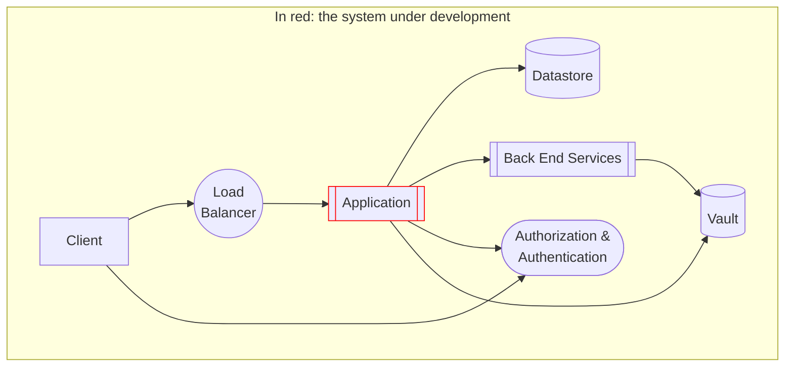

# Considerations for the setup of the development environment

When setting up a development environment, clarify
which components should be verified during the development phase?

Project tend to grow complex and it is not always easy to understand which components are involved in the test.
For example, a modern application relies on many moving parts, including container orchestrators, API gateways, datastores & queues, credentials management, and so on.

Containerization helps in recreating enviroments that are similar to production,
and avoid to implement mocks: see [Prefer Realism Over Isolation](https://abseil.io/resources/swe-book/html/ch13.html#prefer_realism_over_isolation).
This is the reason why this repository contains a `docker-compose.yaml` file that can be used to run the application locally.

Yet, production-like setups can be challenging to maintain in development environments.
Some of the causes are:

- the increased deployment time and latency caused by the major number of components;
- the number of moving parts that could lead to flaky tests or unpredictable results (e.g., network issues, shortage of computational resource, ...);
- the need to maintain a large number of configurations and credentials.

It is then key to identify the components that are relevant for the test during the development phase. At the same time, more comprehensive tests can be run in a specific continuous integration environment, where tests can be retried more easily.

You may want to create different Compose files for different purposes:
for example a simple one for local development running a non-replicated datastore and an in-memory Hashicorp Vault instance;
and a more complex one (or a kubernetes manifest file) with all the bits for a more realistic setup.
